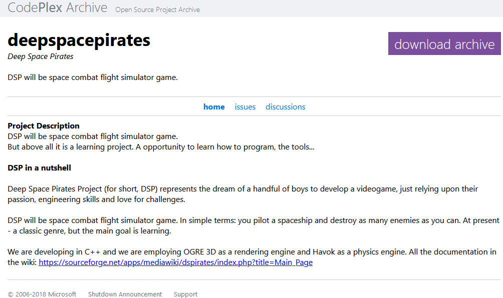

# Deep Space Pirates
...a long time ago, in a galxy not enough far, far, away there were young engineers, just out of university, wanting to learn more, to do better, to go further.

Made strong by their titanic ignorance of what it actually takes to develop a video game, they grabbed their keyboards and set out to work.

[(The Sourceforge page is still there!)](https://sourceforge.net/projects/dspirates/)

Many things happened in life during their quest. Such events as: Codeplex was shut down.

So this repo had to happen.

Did those enthusiastic, foolish and hopeless engineers learn the real lesson?

They themselves doubt it. But it was a fun attempt!

## A special thanks, once again...
...to [Marco](https://github.com/ilpropheta) and [Alessio](https://www.researchgate.net/profile/Alessio-Castorrini), who then went on to much greater things, but still granted me the honor of keeping our code and art safe.

This "old shame" of ours is but one of the reasons why you can see their names so often in the repositories around here.
